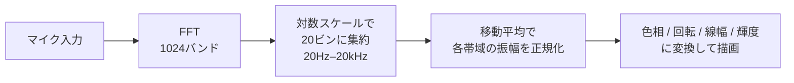
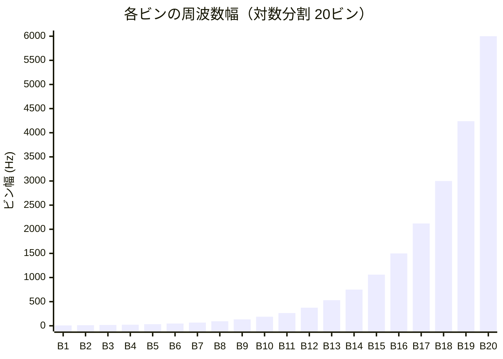
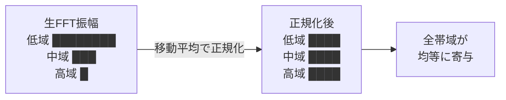
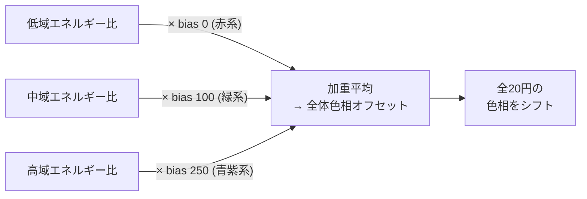
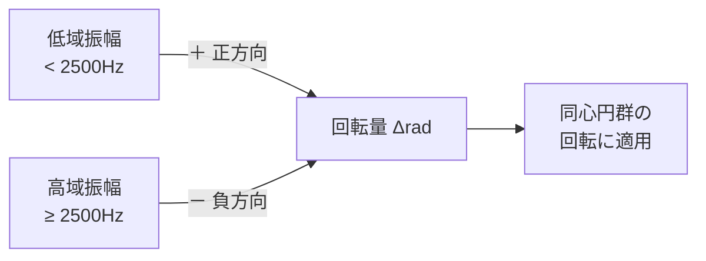
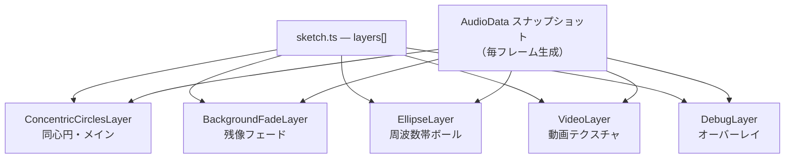

# p5-spectrum-visualizer

p5.js v2（WEBGL）+ TypeScript + Vite によるリアルタイム・オーディオビジュアライザ。

`VisualLayer` インターフェースによる疎結合レイヤー構成・毎フレーム `AudioData` スナップショットによるオーディオ分離・P2D オフスクリーンバッファと WEBGL コンポジットを組み合わせたグラフィック描画パターンをフルスクラッチで実装したプロジェクトです。ライブコーディング用途を想定した拡張しやすい構成を示すポートフォリオとして公開しています。

**デモ:** [https://bonifatius8.github.io/p5-spectrum-visualizer/](https://bonifatius8.github.io/p5-spectrum-visualizer/)

## 使い方

1. 画面をクリック → 初回はブラウザがマイク入力の許可を求める
2. 許可後、マイクからの音声を FFT 解析し描画開始
3. 周波数成分・音量に応じてグラフィックがリアルタイム変化

## 同心円ビジュアライザ

音声には低域に偏ったエネルギー分布がある。そのまま線形マッピングすると低域だけ目立ちビジュアルが単調になるため、周波数軸の変換と振幅の正規化を二段階で行っている。



**周波数軸の対数化** — FFT の 1024 バンドを 20Hz–20kHz の対数スケールで 20 ビンに集約する。線形分割ではなくオクターブ単位で均等に配分することで、低域から高域まで視覚的に均等な帯域幅を確保している。



> 低域ビンは数 Hz 幅、高域ビンは数千 Hz 幅になる。これが人間の聴覚の対数的な周波数感度に対応している。

**振幅の正規化** — 各ビンの振幅を移動平均フィルターで時間的に平滑化し、その逆数で重み付けする。これにより特定の帯域が常に突出することなく、全帯域が均等にビジュアルへ寄与するよう調整される。



**色相** — 各円の基本色相はインデックスから均等割り付けされる。全体の色相オフセットは低/中/高域のエネルギー比から動的に算出され、低域優勢なら赤系（bias 0）、中域なら緑系（bias 100）、高域なら青紫系（bias 250）に全体が傾く。



**回転** — 2500Hz 未満の低域振幅が正方向、高域が負方向に回転量を寄与する。帯域バランスによって回転方向と速度がリアルタイムで変化する。



**線幅・輝度・α** — 各ビンの振幅で個別にスケールする。音が大きいほど太く明るくなる。REMOVE ブレンドで重なり部分を抜くことで同心円間のコントラストを生む。

## エリプス

100 本のボールが FFT ビンの X 座標に配置される。周波数軸は線形で画面幅に展開し、各ボールは対応する周波数帯の振幅を監視する。振幅が閾値を超えるとボールが反応し、速度・重力・減衰を伴う物理シミュレーションで動く。`decayTimeout` 後は徐々にサイズと透明度が減衰する。

## レイヤー構成

描画構成を `VisualLayer` インターフェースによる疎結合レイヤーとして定義する。`sketch.ts` の `layers[]` 配列が唯一の構成変更点であり、レイヤーの追加・削除・並び替えだけで描画構成を変更できる。



各レイヤーには毎フレーム生成した `AudioData` スナップショットが渡される。レイヤーは `AudioContext` に直接アクセスしない設計により、音声処理と描画処理が完全に分離されている。描画は WEBGL メインキャンバスと P2D オフスクリーンバッファの二層構造で行い、`texture()` + `plane()` でコンポジットする。

## エンジニアリング上の配慮

**`AudioData` スナップショットパターン** — `AudioContext` をレイヤーに直接渡さず、毎フレームのデータを値オブジェクトとして渡す。レイヤーが音声処理の副作用を持てない構造にし、描画ロジックの独立性を保証する。

**P2D オフスクリーンバッファ + WEBGL コンポジット** — WEBGL モードでは 2D 描画 API の一部が不安定になるため、各レイヤーは P2D バッファに描画し WEBGL 側でテクスチャとして合成する。描画とレンダリングパイプラインを分離することで、レイヤーの実装が WEBGL の制約に依存しない。

**`WindowWithWebkitAudio` インターフェース** — webkit プレフィックス付き `AudioContext` の互換処理を `as any` キャストではなく専用インターフェースで実装。型安全性を維持しつつブラウザ互換を確保する。

**`as const` による設定値のリテラル型化** — `sketchConfig.ts` の `Config` オブジェクトに `as const` を付与し、全値をリテラル型かつ `readonly` にする。設定値の誤代入をコンパイル時に検出できる。

**`catch (e: unknown)` による型安全なエラーハンドリング** — catch 節の変数を `unknown` として明示し、`any` 型での暗黙的エラーアクセスを防ぐ。

---

## 開発環境

```sh
npm install
npm run dev
```

## スタック

- p5.js v2 (WEBGL)
- TypeScript 5 + Vite
- Web Audio API (getUserMedia → AnalyserNode → FFT)

## 構成

```text
src/
  sketch.ts                    # エントリ。レイヤー定義のみ
  AudioData.ts                 # 毎フレームのオーディオスナップショット型
  VisualLayer.ts               # レイヤーインターフェース
  spectrumAnalyzerClass.ts     # マイク取得・FFT
  sketchConfig.ts              # 定数
  layers/
    ConcentricCirclesLayer.ts  # 同心円（メイン）
    BackgroundFadeLayer.ts     # 残像フェード
    EllipseLayer.ts            # 周波数帯エリプス
    VideoLayer.ts              # 動画テクスチャ
    DebugLayer.ts              # デバッグオーバーレイ
  concentricCircles.ts         # 同心円描画ロジック
  ellipse.ts / ellipsePhysics.ts
  aWeightingFilter.ts          # A特性フィルター
  movingAverageFilter.ts       # 移動平均フィルター
```

---

## 修正履歴

### 2025-05-09: マイクアクセス許可

リロード後にマイク許可が再要求されず音声入力が無効化される問題を修正。AudioContext 初期化をユーザークリックトリガーに変更。

### 2025-05-09: 物理シミュレーション

エリプスに質量・速度・加速度モデルを導入。低周波ほど跳ね返り係数が大きくなるよう動的調整、速度比例の抵抗力を追加。

### 2025-05-10: クリック範囲

特定エリア外でクリックが無効になる問題を修正。canvas 全体へイベントリスナーを設定。

### 2025-05-12: 同心円描画

円ごとの周波数割り当てを bands 幅に対応。A特性フィルター適用、描画と計算を分離。

### 2025-05-12: モジュール分離

物理シミュレーションを `ellipsePhysics.ts`、FFT 解析を `spectrumAnalyzerClass.ts` に分離。
