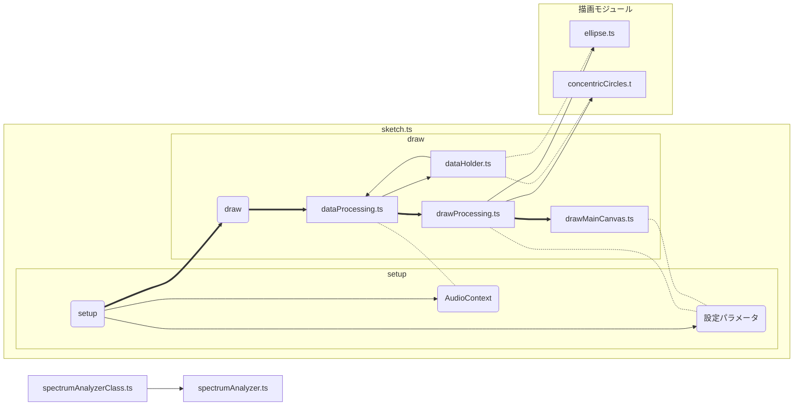

# モジュール連関図

-   dataHolder: アプリケーション全体で使用されるデータを一元的に管理し、データの永続化を担当します。具体的には、AudioContext、設定パラメータ、FFT データなどを管理します。
-   dataProcessing: dataHolder からデータを受け取り、描画モジュールが使用できる形式に変換する役割を担います。具体的には、スペクトラムデータの平滑化、正規化、A 特性補正などを行います。

※関数オブジェクトを使用する。クラスは用いない
